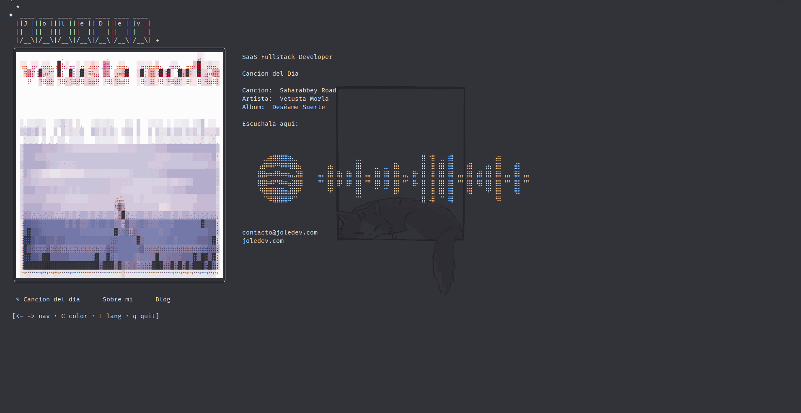

# ssh.joledev.com

```
ssh ssh.joledev.com
```



Un portafolio personal al que se accede por terminal. En lugar de un sitio web, los visitantes se conectan por SSH y navegan una TUI con arte de portada, una cancion del dia, un blog y una seccion de about.

La idea nacio de un reel de Instagram de [@morilliu](https://instagram.com/morilliu).

## Secciones

**Cancion del dia** — Lo primero que ves al conectarte. Cada dia se selecciona una cancion de forma determinista de un catalogo de 578+ tracks. La portada del album se obtiene de Spotify en tiempo real y se renderiza como arte braille unicode. Debajo se muestra un Spotify Code escaneable para abrir la cancion desde el telefono.

**Sobre mi** — Una breve intro de quien soy, que hago y la historia detras de este proyecto.

**Blog** — Posts en markdown organizados por idioma (`posts/es/`, `posts/en/`). Frontmatter simple con `# Titulo` y `date: YYYY-MM-DD`.

## Controles

| Tecla | Accion |
|-------|--------|
| `←` `→` | Cambiar seccion |
| `C` | Alternar portada B&W / color |
| `L` | Cambiar idioma (ES/EN) |
| `R` | Reintentar carga de portada |
| `q` | Salir |
| `enter` | Leer post |
| `esc` | Volver a la lista |

## Como funciona

El servidor es un solo binario de Go. Cuando alguien se conecta por SSH se le asigna un programa Bubbletea dentro de su sesion. No hay shell, no hay acceso a archivos — solo una TUI renderizada en su terminal.

### Portada del album

Se obtiene en vivo desde la API oEmbed de Spotify y se convierte a caracteres braille unicode (bloque `U+2800`). Cada caracter braille codifica una cuadricula de 2x4 pixeles, lo que da ~8x la resolucion de caracteres normales.

Pipeline:

1. **Fetch** — oEmbed para obtener el thumbnail, luego descarga la imagen
2. **Resize** — Downscale por promedio de area
3. **Grayscale** — Luminancia ponderada BT.601
4. **Contraste** — Mejora de contraste alrededor de la media
5. **Dither** — Difusion de error Floyd-Steinberg (version B&W)
6. **Mapeo** — Cada bloque 2x4 se mapea a un caracter braille

El modo color agrega ANSI true color de 24 bits por celda braille, promediando los colores de pixeles de foreground y background por separado.

### Spotify Code

El barcode escaneable se obtiene del endpoint `scannables.scdn.co` de Spotify y se renderiza con un pipeline braille separado: unsharp mask para bordes nitidos y threshold duro en lugar de dithering (mas limpio para patrones geometricos).

### Cancion del dia

SHA-256 del dia actual (timezone `America/Tijuana`) como seed determinista para seleccionar del catalogo. Misma cancion para todos, todo el dia.

## Stack

| | |
|---|---|
| Go 1.24 | Lenguaje |
| [Wish](https://github.com/charmbracelet/wish) | Servidor SSH |
| [Bubbletea](https://github.com/charmbracelet/bubbletea) | Framework TUI |
| [Lipgloss](https://github.com/charmbracelet/lipgloss) | Estilos |
| Spotify oEmbed + Scannables | Arte de portada y Spotify Code |
| GitHub Actions + systemd | Deploy |

## Estructura

```
.
├── main.go                      # Entrypoint del servidor SSH
├── internal/
│   ├── tui/
│   │   ├── model.go             # Modelo Bubbletea, update loop, vistas
│   │   ├── styles.go            # Estilos Lipgloss
│   │   └── i18n.go              # Traducciones ES/EN
│   ├── art/
│   │   ├── braille.go           # Conversor imagen-a-braille (mono + color)
│   │   ├── spotifycode.go       # Fetch y render del Spotify Code
│   │   └── fetch.go             # Fetch de portada via Spotify oEmbed
│   └── data/
│       ├── songs.go             # Carga de canciones + seleccion del dia
│       └── blog.go              # Carga de posts markdown
├── data/
│   └── songs.txt                # Catalogo (artist|title|album|year|url)
├── posts/
│   ├── es/
│   └── en/
└── deploy/
    ├── ssh-joledev.service      # Unidad systemd
    └── setup.sh
```

## Correr localmente

```bash
go build -o ssh.joledev .
./ssh.joledev
```

```bash
ssh localhost -p 2222
```

### Variables de entorno

| Variable | Default | Descripcion |
|----------|---------|-------------|
| `SSH_HOST` | `0.0.0.0` | Direccion de bind |
| `SSH_PORT` | `2222` | Puerto |
| `SSH_KEY_PATH` | `.ssh/host_key` | Ruta al host key (se autogenera) |
| `SONGS_PATH` | `data/songs.txt` | Ruta al catalogo de canciones |
| `POSTS_DIR` | `posts` | Ruta al directorio de posts |

## Agregar canciones

Editar `data/songs.txt`, una cancion por linea:

```
Artista|Titulo|Album|Ano|spotify_url
```

Lineas que empiezan con `#` se ignoran.

## Agregar posts

Crear un `.md` en `posts/es/` o `posts/en/`:

```markdown
# Titulo del post
date: 2025-01-15

Contenido aqui.
```

## Deploy

Push a `main`. GitHub Actions compila para Linux, copia al VPS por SCP y reinicia el servicio systemd. Los datos de conexion estan en GitHub Secrets.

## Licencia

MIT
